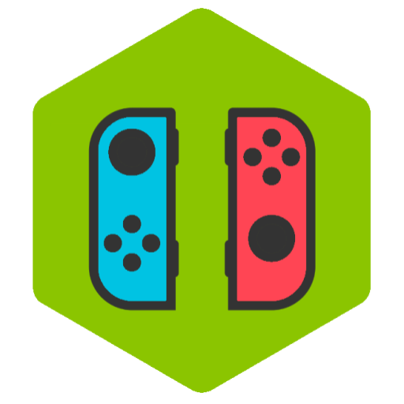

# **ns-joycon** - Bridge between Joy-Con and Node.js

<center>


**ns-joycon** controls buffer stream by HID, and extracts the data from accelerometer, gyroscope and HD Rumble.

This project is an implementation from [dekuNukem/Nintendo_Switch_Reverse_Engineering](https://github.com/dekuNukem/Nintendo_Switch_Reverse_Engineering) by Node.js.

 [](https://travis-ci.org/wazho/ns-joycon) [](https://www.npmjs.com/package/ns-joycon)
</center>

---

## Quick start

### Installation

```shell
npm install ns-joycon
# If you encounter some problems when `npm install ns-joycon`.
npm install ns-joycon --unsafe-perm
```

### DEMO

Checkout the demo project at [wazho/ns-joycon-showcases](https://github.com/wazho/ns-joycon-showcases).

### Usage

Connect your Joy-Con(s) using bluetooth with PC (currently Linux only).

And then execute program by administrator below (root can access hardware).

```typescript
const JoyCon = require('ns-joycon');    // JavaScript
// import * as JoyCon from 'ns-joycon'; // TypeScript or Babel

const { joycons } = JoyCon.findControllers();

joycons.forEach(async (device) => {
  device.manageHandler('add', (packet) => {
    console.log(device.meta.product, packet);
  });
  await device.enableIMU();
});
```

### Tests

```shell
npm test
```

---

## APIs

### **JoyCon.findControllers()**

  Find controllers that are detected.

* **Return value**

  `{ joycons, proControllers }`

### **device.manageHandler(action, callback)**

  Add a handler to process packet data.

* **Arguments**

  `action` is `add | remove`

  `callback` is of the form `callback(data)`

### **device.requestDeviceInfo()**

  Request Joy-Con to provide its device info.

* **Return value**

  `Promise<DeviceInfo>` is `{ firmwareVersion, type, macAddress, spiColorInUsed }`

### **device.enableIMU()**

  Enable inertial measurement unit (IMU).

  After this script, controller will send **Input Report 0x30** per 15 ms.

* **Return value**

  `Promise<void>`

### **device.disableIMU()**

  Disable inertial measurement unit (IMU).

* **Return value**

  `Promise<void>`

### **device.enableVibration()**

  Enable vibration for a while.

* **Return value**

  `Promise<void>`

### **device.disableVibration()**

  Disable vibration in immediately.

* **Return value**

  `Promise<void>`

---

## Extracted data

Real data from Joy-Con (R) below.

```
<Buffer 30, 3e, 4e, 0a, 10, 00, 00, 00,
        00, c7, 18, 76, 09, 1a, 00, f1,
        09, d5, f3, b4, ff, 5b, ff, 90,
        ff, 17, 00, de, 09, c7, f3, af,
        ff, 5e, ff, 8f, ff, 0a, 00, cd,
        09, c7, f3, b8, ff, 65, ff, 89,
        ff>
```

### Input Report ID

```jsonc
// inputReportID
{
  "_raw": "<Buffer 30>",
  "_hex": ["30"]
}
```

### Timer

```jsonc
// Timer
{
  "_raw": "<Buffer 2c>",
  "_hex": ["2c"]
}
```

### Battery Level

```jsonc
// batteryLevel
{
  "_raw": "<Buffer 4e>",
  "_hex": ["4"],
  "level": "medium"
}
```

### Connection Info

```jsonc
// connectionInfo
{
  "_raw": "<Buffer 4e>",
  "_hex": ["e"]
}
```

### Button Status

```jsonc
// buttonStatus
{
  "_raw": "<Buffer 00 00 00>",
  "_hex": [ "00", "00", "00" ],
  "y": false,
  "x": false,
  "b": false,
  "a": false,
  "r": false,
  "zr": false,
  "down": false,
  "up": false,
  "right": false,
  "left": false,
  "l": false,
  "zl": false,
  "sr": false,
  "sl": false,
  "minus": false,
  "plus": false,
  "rightStick": false,
  "leftStick": false,
  "home": false,
  "caputure": false,
  "chargingGrip": false
}
```

### Analog Sticks

#### Stick Left

```jsonc
// analogStickLeft
{
  "_raw": "<Buffer 00 00 00>",
  "_hex": [ "00", "00", "00" ],
  "horizontal": 0,
  "vertical": 0
}
```

#### Stick Right

```jsonc
// analogStickRight
{
  "_raw": "<Buffer 70 c8 75>",
  "_hex": [ "70", "c8", "75" ],
  "horizontal": 2160,
  "vertical": 1884
}
```

### Vibrator

```jsonc
// vibrator
{
  "_raw": "<Buffer 0a>",
  "_hex": [ "0a" ]
}
```

### Accelerometers

```jsonc
// accelerometers
[
  {
    "x": {
      "_raw": "<Buffer 67 01>",
      "_hex": [ "67", "01" ],
      "acc": 0.087596
    },
    "y": {
      "_raw": "<Buffer 23 00>",
      "_hex": [ "23", "00" ],
      "acc": 0.00854
    },
    "z": {
      "_raw": "<Buffer 61 f0>",
      "_hex": [ "61", "f0" ],
      "acc": -0.975756
    }
  },
  // Repeat two more, totally collected three times.
]
```

### Gyroscopes

```jsonc
// gyroscopes
[
  [
    {
      "_raw": "<Buffer 17 00>",
      "_hex": [ "17", "00" ],
      "dps": 1.40369,
      "rps": 0.003896
    },
    {
      "_raw": "<Buffer ca ff>",
      "_hex": [ "ca", "ff" ],
      "dps": -3.29562,
      "rps": -0.009148
    },
    {
      "_raw": "<Buffer d8 ff>",
      "_hex": [ "d8", "ff" ],
      "dps": -2.4412,
      "rps": -0.006776
    }
  ],
  // Repeat two more, totally collected three times.
]
```

### [Extra] Actual Accelerometer

Average of 3 times **accelerometers**.

```jsonc
// actualAccelerometer
{
  "acc": {
    "x": 0.001305,
    "y": 0.000137,
    "z": -0.014623
  }
}
```

### [Extra] Actual Gyroscope

Average of 3 times **gyroscopes**.

```jsonc
// actualGyroscope
{
  "dps": [ 0.02014, -0.049129, -0.035703 ],
  "rps": [ 0.000056, -0.000136, -0.000099 ]
}
```
